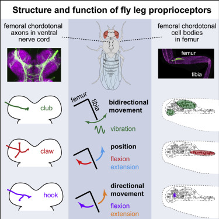

# NeuralCodingOfLegProprioception_LegTrackingAndSynchronization
Scripts for tracking and analyzing tibia position data presented in "Neural Coding of Leg Proprioception in Drosophila" (Mamiya, Gurung, and Tuthill (2018) Neuron: DOI:https://doi.org/10.1016/j.neuron.2018.09.009). Also scripts for synchronizing calcium imaging data with tibia tracking data and piezo movement data.

